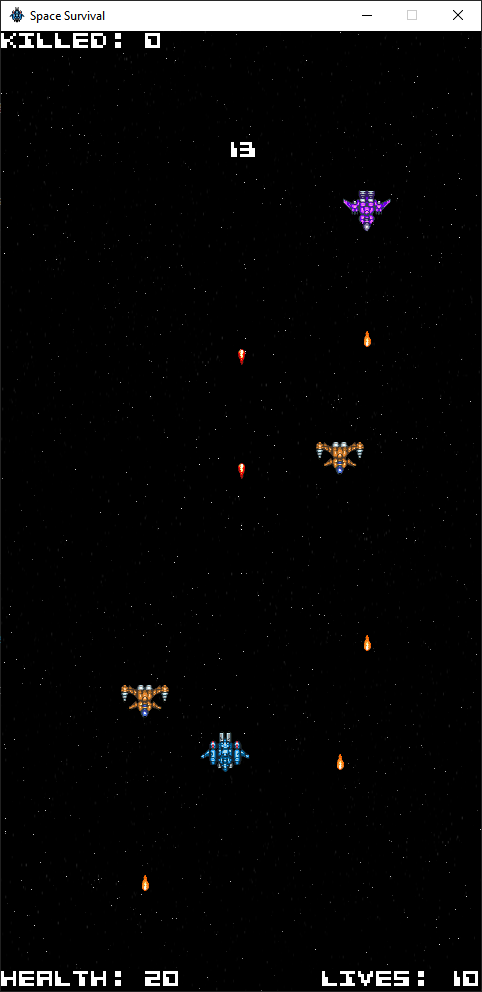

# Space Survival

This is a simple game I wrote with Pygame about surviving in space, thus called "Space Survival." Obviously, obviously it draws a lot of inspiration from the game "Space Invader.".

## Installation

1. Install the latest release, if available.
2. Make sure you have Python installed (version 3.10 or latest).
3. Run `pip install -r requirements.txt` to install the necessary dependencies if you haven't already.
4. Run `run.bat` to start the game.
